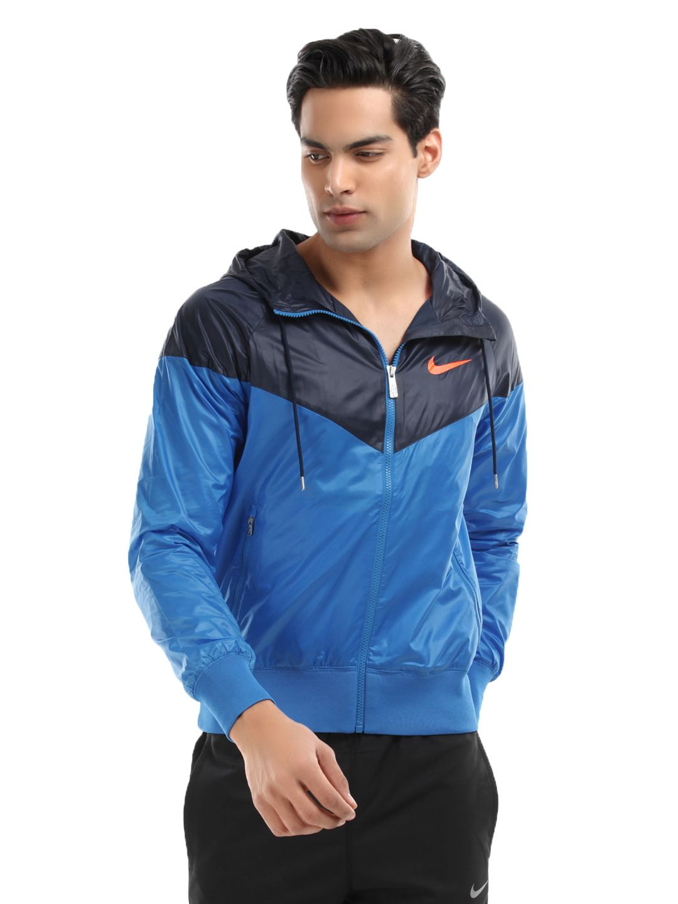
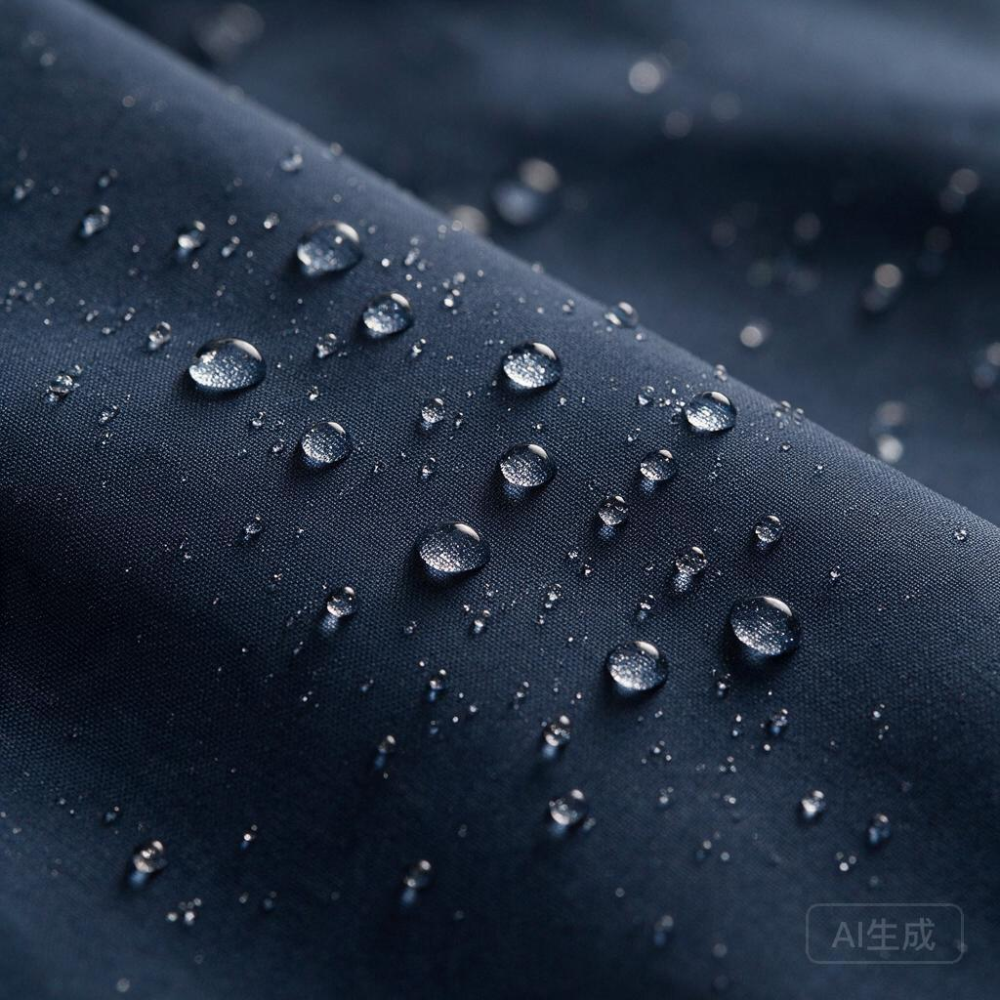

# 冲锋衣 SKU-JK902 技术规格书

> 文档编号: DOC-PROD-JK902-TECH
> 商品代号: SKU-JK902 (Ultralight 3L Waterproof Hardshell Jacket)
> 类目: 户外硬壳冲锋衣
> 性别: 男款
> 季节: 2026 秋冬
> 状态: Active

---

## 1. 产品概述

三层面料复合轻量全防水硬壳冲锋衣，定位中高端户外运动市场。目标用户为北美地区徒步、登山、通勤骑行爱好者。

核心卖点：全衣13mm窄环保PU热熔全压胶条暴雨级全防水；静水压≥15,000mm H2O；透湿率≥18,000 g/m²/24h；肩肘Cordura 500D加强，马丁代尔耐磨>50,000转；单件M码380g。

---

## 2. 面料结构

### 2.1 三层复合

| 层级 | 材质 | 规格 | 功能 |
| :--- | :--- | :--- | :--- |
| 外层 | 尼龙平纹面料 | 40D, 58 GSM | 耐磨骨架, DWR持久防泼水 |
| 中层 | ePTFE微孔膜 | 0.02mm | 防水透湿核心, 孔径0.2µm |
| 内层 | 涤纶经编衬里 | 20D, 35 GSM | 保护微孔膜, 贴肤舒适 |

复合工艺: 无溶剂聚氨酯热熔复合, 130°C, 3 bar。

### 2.2 防水性能

- 静水压: ≥15,000mm H2O (AATCC 127 / ISO 811)
- DWR涂层: C0无氟碳防水剂, 接触角≥130°, 20次洗涤后≥110°
- 判定: 符合FTC 16 CFR Part 303及ASTM D3393全防水标称条件

### 2.3 透湿性能

- 透湿率: ≥18,000 g/m²/24h (JIS L1099 B1)
- 原理: ePTFE微孔0.2µm, 水蒸气分子0.0004µm可通过, 水滴100µm无法穿透

---

## 3. 辅料与五金

### 3.1 拉链系统

| 部位 | 规格 | 品牌 | 防水 |
| :--- | :--- | :--- | :--- |
| 主门襟 | 8# | YKK Vislon Aquaguard | 闭链防水≥5,000mm |
| 腋下透气孔 | 5# | YKK Vislon Aquaguard | 同上 |
| 胸前口袋 | 5# | YKK Vislon Aquaguard | 同上 |

拉链头: 金属防腐蚀镀层, 拉/开力≤30N (ISO 2248)。

### 3.2 调节扣具

| 部位 | 品牌 | 规格 |
| :--- | :--- | :--- |
| 防风帽调节 | Duraflex UTX | 单手调节塞扣 |
| 下摆调节 | Duraflex UTX | 弹簧塞扣 |
| 袖口 | 3M | Scotchmate SJ3521魔术贴 |

材质: 军规塑钢(Glass Filled Nylon), 耐低温-40°C。

### 3.3 抽绳

3mm涤纶低弹抽绳, 断裂强力≥80N。防风帽双向调节, 收紧后帽檐前移15mm不挡视野。

---

## 4. 加强部位与耐磨

### 4.1 Cordura加强

| 部位 | 材质 | 面积 | 理由 |
| :--- | :--- | :--- | :--- |
| 肩部 | Cordura 500D | 两侧120×80mm | 背包肩带摩擦 |
| 肘部 | Cordura 500D | 两侧150×100mm | 弯肘摩擦+地面接触 |
| 下摆前沿 | Cordura 500D | 前片200×30mm | 安全带/攀岩绳摩擦 |

耐磨: 马丁代尔(ISO 12947-2) >50,000转无破损。

### 4.2 接缝工艺

- 全衣13mm环保PU热熔全压胶条(Fully Tapped Seams), bluesign蓝标认证
- 压胶: 140°C, 2.5bar, 8m/min
- 接缝强度: ≥400N (ISO 13935-1)
- 接缝静水压: ≥12,000mm

---

## 5. 结构设计

### 5.1 版型

男款直筒宽松工装版型(Relaxed Regular Fit), 肩部2英寸运动放量, 后背育克线(Yoke)分割提升上举活动量。

### 5.2 口袋

| 口袋 | 位置 | 规格 | 开口 |
| :--- | :--- | :--- | :--- |
| 胸前袋 | 左胸 | 180×120mm | 防水拉链竖向 |
| 手插袋 | 两侧腰侧 | 200×140mm | 防水拉链斜向 |
| 内袋 | 左内里 | 160×100mm | 无拉针织罗纹口 |

### 5.3 帽兜

三维立体裁剪可容纳头盔, 帽檐内置可塑骨架, 后脑可调节收紧, 风速≤8m/s不脱落。

---

## 6. 尺寸与版型

| 尺码 | 胸围 | 肩宽 | 袖长 | 衣长 |
| :---: | :---: | :---: | :---: | :---: |
| S (34-36) | 35.0"-37.0" | 17.5" | 33.5" | 28" |
| M (38-40) | 38.0"-40.0" | 18.5" | 34.5" | 29" |
| L (42-44) | 41.0"-43.0" | 19.5" | 35.5" | 30" |
| XL (46-48) | 44.0"-47.0" | 20.5" | 36.5" | 31" |

详细数据参见 `data/尺码表/男款-2026现行.md`。

---

## 7. 包装与标签

### 7.1 吊牌

品牌吊牌(350g白卡纸哑膜)+FTC纤维成分标签(Shell: 100% Nylon; Membrane: PTFE; Lining: 100% Polyester)+产地标签(Made in Vietnam)+洗护标签。

### 7.2 包装

单件PE防潮袋200×150mm, 外箱5层瓦楞纸箱20件/箱580×420×320mm。单件M码380g, 整箱毛重9.2kg。

### 7.3 洗护说明

机洗冷水30°C, 不可氯漂, 不可高温烘干阴干, 不可干洗(溶剂破坏压胶条), 不可熨烫。DWR恢复: 每20次洗涤后低温烘干20分钟可恢复防泼水。
