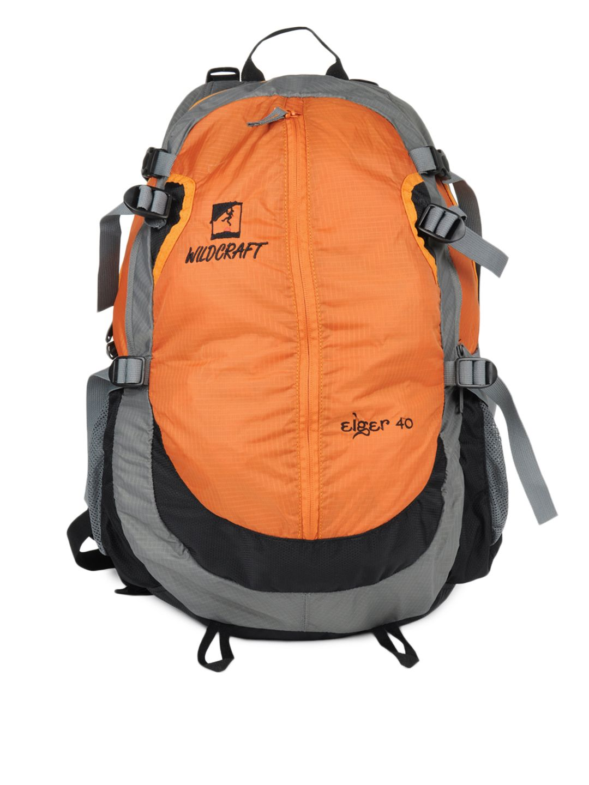
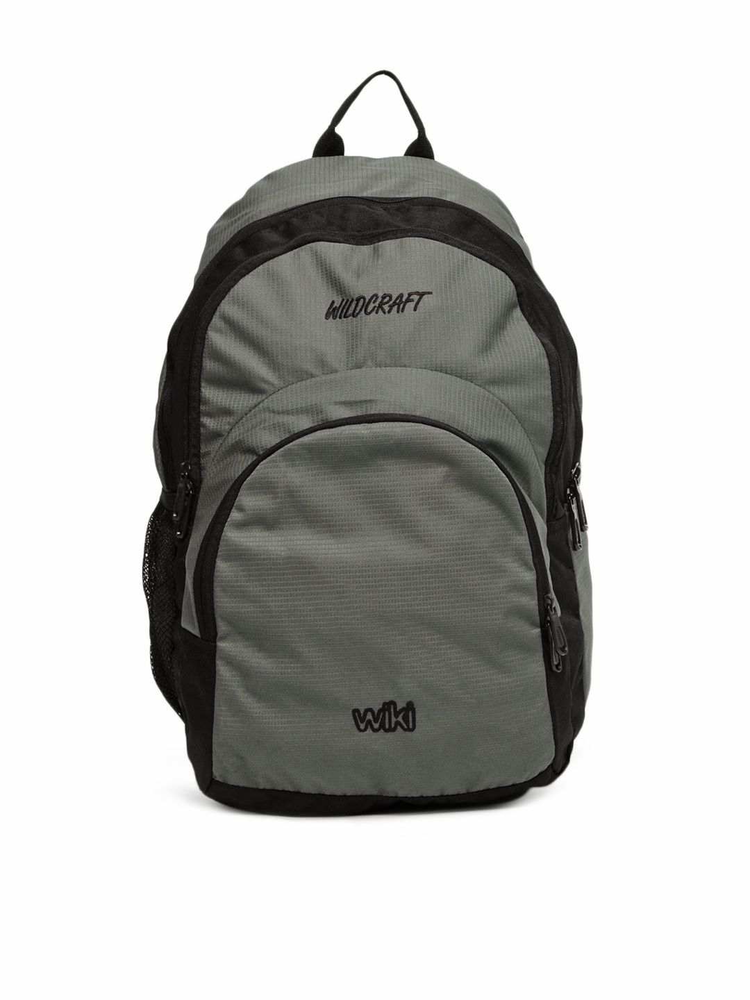

# 战术背包 SKU-BP701 技术规格书

> 文档编号: DOC-PROD-BP701-TECH
> 商品代号: SKU-BP701 (40L Modular Tactical EDC Backpack)
> 类目: 战术/EDC 双肩包
> 性别: 通用
> 季节: 2026 全年常青款
> 状态: Active

---

## 1. 产品概述

40L模块化战术日常背包，定位北美EDC与户外战术市场。目标用户为军迷、户外爱好者、通勤族。

核心卖点：100% Cordura 500D涂层尼龙DuPont Teflon三防；Duraflex UTX军规塑钢扣具-40°C；YKK 10#重型双向拉链咬合≥120N；模块化MOLLE系统可外挂副包/伞绳/工具。

---

## 2. 面料规格

### 2.1 主料

100% Cordura 500D涂层尼龙(500 Denier Ballistic Nylon)，克重200 GSM，厚度0.45mm。表面DuPont Teflon防污/防泼水/防油三防处理。背面PU涂层防水≥5,000mm H2O。

Cordura 500D由英威达(Invista)注册，使用需在后台备案授权挂牌编号。

### 2.2 物理性能

| 指标 | 方法 | 结果 |
| :--- | :--- | :--- |
| 断裂强力(经向) | ASTM D5034 | ≥1,800N |
| 断裂强力(纬向) | ASTM D5034 | ≥1,500N |
| 撕裂强力(经向) | ASTM D5587 | ≥120N |
| 耐磨(马丁代尔) | ISO 12947-2 | >30,000转 |
| 防水性(面料) | AATCC 127 | ≥5,000mm |
| DWR防泼水 | AATCC 22 | 90分(初始) |

### 2.3 辅料

| 部位 | 材质 | 规格 |
| :--- | :--- | :--- |
| 背板海绵 | EVA记忆海绵 | 10mm厚, 40kg/m³ |
| 背板网布 | 3D空间网布 | 5mm厚, 透气200mm/s |
| 腰带衬垫 | EVA+记忆海绵 | 双层15mm |

---

## 3. 五金配件

### 3.1 扣具

| 部位 | 规格 | 品牌 | 材质 |
| :--- | :--- | :--- | :--- |
| 主扣(胸带/腰带) | 38mm双向调节 | Duraflex UTX | 玻纤增强尼龙 |
| 副扣(副仓/压缩带) | 25mm弼弓扣 | Duraflex UTX | 同上 |
| 拉链头止 | 10#金属止拉 | YKK | 锌合金 |

耐低温-40°C无脆裂(ASTM D746)。

### 3.2 拉链

| 部位 | 规格 | 品牌 |
| :--- | :--- | :--- |
| 主仓 | 10#双向 | YKK重型 |
| 副仓(前/侧) | 8#单向 | YKK重型 |
| 隐藏仓(贴背) | 5#单向 | YKK |

咬合强力≥120N(ISO 2248)，平拉≥140N(ISO 2247)，开合5,000次无卡顿。

---

## 4. 结构设计

### 4.1 仓体布局

| 仓体 | 位置 | 容量 | 开口 | 特点 |
| :--- | :--- | :--- | :--- | :--- |
| 主仓 | 中部 | 30L | U型大开口10#双向 | 双层底板, 可放17"笔记本/3L水袋 |
| 前副仓 | 前部 | 6L | 竖向8# | 整理袋×4, 钥匙扣 |
| 侧副仓(左) | 左侧 | 2L | 竖向8# | 可放500ml水壶 |
| 侧副仓(右) | 右侧 | 2L | 弼力网兜 | 可放500ml水壶/折叠伞 |
| 贴背隐藏仓 | 贴背 | 1L | 横向5# | 放护照/钱包 |

### 4.2 MOLLE系统

正面6行×4列MOLLE织带(25mm宽, 间距38mm)，两侧各2行×3列。可外挂副包/医疗包/伞绳/工具夹/登山扣。织带缝制强度≥200N/条。

### 4.3 背负系统

- 背板: 10mm EVA记忆海绵 + 硬质HDPE板材骨架
- 背面: 3D空间网布透气率200mm/s
- 肩带: S型人体工学, 7mm EVA衬垫, 宽70mm
- 胸带: 38mm弼性带可上下调节
- 腰带: 可拆卸, 15mm双层衬垫, 宽80mm

### 4.4 提手

顶部提手包裹Cordura面料内衬EVA宽40mm承重≥30kg。两侧各1简易织带环。

---

## 5. 尺寸规格

| 维度 | 尺寸 |
| :--- | :--- |
| 高度 | 520mm |
| 宽度 | 320mm |
| 深度 | 220mm |
| 总容量 | 40L |
| 空包重量 | 1,350g |
| 最大承重 | 25kg |
| 适用torso | 40-53cm |

---

## 6. 包装与标签

品牌吊牌+Cordura授权挂牌编号+成分标签(Shell: 100% Nylon)+产地(Made in Vietnam)+洗护标签(手洗不可机洗)。防尘袋350×280mm，外箱5层瓦楞10件/箱，空包1,350g。
