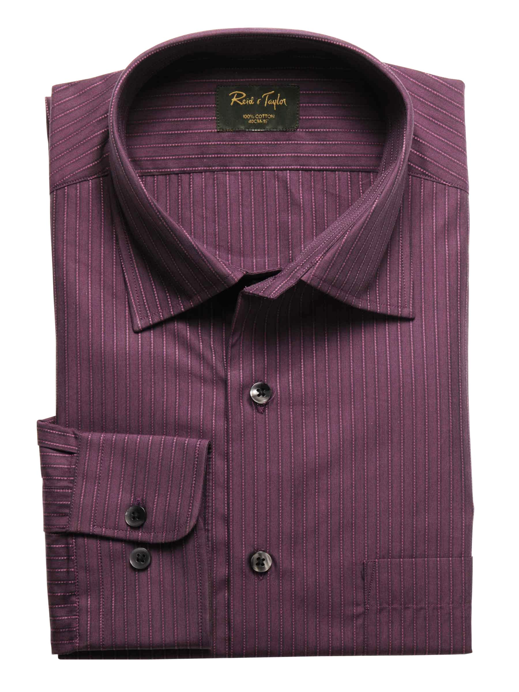
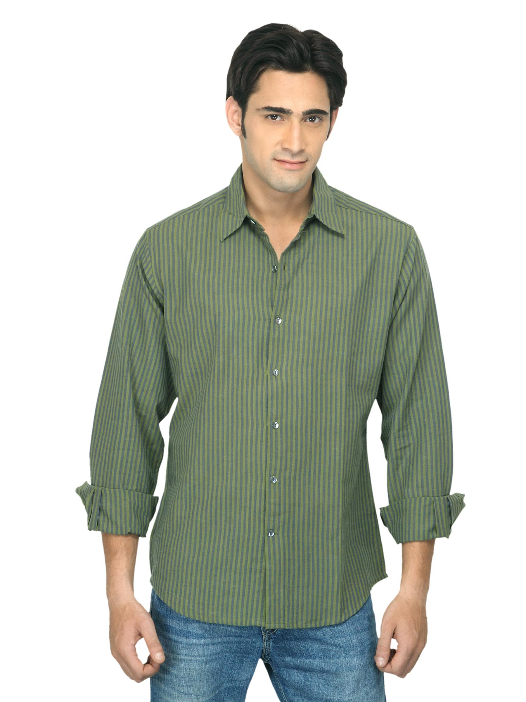

# 羊毛开衫 SKU-CR502 技术规格书

| 项目 | 内容 |
|------|------|
| 商品代号 | SKU-CR502 |
| 商品名称 | Classic Heritage Relaxed Knit Cardigan |
| 品牌 | HZR Knitwear |
| 适用场景 | 休闲通勤 / 商务日常 |
| 目标站点 | Amazon US |
| 上架日期 | 2025-02-10 |

---

## 1. 产品概述

SKU-CR502 是一款经典复古宽松落肩开衫，采用 100% 澳大利亚进口超细美利奴羊毛为原料，纤维细度 ≤ 19.5 微米，经德国 Stoll 电脑横机 16 针高密精纺成形。版型取自经典老钱风（Old Money）落肩宽松廓形，配天然牛角扣及 2×2 罗纹加固门襟。成品经丝光、防缩、防起球等多道后整理工艺，满足日常机洗不缩水、不起球的穿着要求。

| 核心参数 | 规格 |
|----------|------|
| 款式 | 经典圆领开衫 |
| 版型 | 落肩宽松版型（Old Money 老钱风） |
| 面料 | 100% 澳大利亚超细美利奴羊毛 |
| 纤维细度 | ≤ 19.5 微米 |
| 编织方式 | 德国 Stoll 电脑横机 16 针高密精纺 |
| 纽扣 | 天然牛角扣 |
| 门襟 | 2×2 罗纹加固门襟 |
| 克重 | 320 ± 5 g/m² |
| 可机洗 | 是（Woolmark 可机洗认证） |

---

## 2. 纱线规格

### 2.1 原料信息

| 参数 | 规格 |
|------|------|
| 纤维类型 | 美利奴羊毛（Merino Wool） |
| 产地 | 澳大利亚 |
| 纤维细度 | ≤ 19.5 μm（相当于 80 支） |
| 纤维长度 | 平均长度 ≥ 70 mm |
| 线密度 | 26 Nm/2（双股） |
| 捻度 | 650 ± 20 捻/米（Z 捻合股 S 捻） |
| 线圈线密度 | 68 tex/2 |

### 2.2 纱线品质

| 参数 | 规格 | 测试标准 |
|------|------|----------|
| 条干均匀度 | CV ≤ 12% | Uster Tester 5 |
| 细节/粗节/棉结 | 符合 Uster 5%-25% 水平 | Uster Tester 5 |
| 断裂强力 | ≥ 8.5 cN/tex | GB/T 3916 |
| 断裂伸长率 | 10% ~ 15% | GB/T 3916 |
| 回潮率 | 15% ~ 18% | GB/T 9995 |

---

## 3. 编织工艺

### 3.1 设备参数

| 参数 | 规格 |
|------|------|
| 机型 | 德国 Stoll CMS 330 HP PCX |
| 机号 | 16 针/英寸（16G） |
| 成圈系统 | 2 系统 |
| 编织速度 | 1.2 m/s |
| 牵拉方式 | 主牵拉辊 + 辅助牵拉 |
| 起针方式 | 废纱起针 + 翻针 |

### 3.2 组织结构

| 部位 | 组织 | 规格 |
|------|------|------|
| 大身 | 1×1 单面平针 | 纵密 90 横列/10cm，横密 75 纵行/10cm |
| 门襟 | 2×2 罗纹 | 纵密 110 横列/10cm，横密 60 纵行/10cm |
| 袖口 | 2×2 罗纹 | 纵密 110 横列/10cm，横密 58 纵行/10cm |
| 下摆 | 2×2 罗纹 | 纵密 110 横列/10cm，横密 58 纵行/10cm |
| 领口 | 单面挑孔包边 | 纵密 95 横列/10cm |

### 3.3 成形工艺

| 工艺项 | 规格 |
|--------|------|
| 衣身成形 | 整片成形，两侧无侧缝 |
| 袖子成形 | 蝙蝠袖式，肩部无装袖缝 |
| 肩部 | 落肩设计，落肩量 4 cm |
| 收针方式 | 移针式收针（明收针） |
| 领口成形 | 挑孔起针，圆顺过渡 |

---

## 4. 版型设计

### 4.1 廓形参数

| 参数 | 规格 |
|------|------|
| 廓形分类 | 落肩宽松版型（H 型微 A 摆） |
| 肩线处理 | 落肩设计，肩线下移 4 cm |
| 衣身长度 | 中长款（盖臀线） |
| 袖型 | 蝙蝠袖，袖口收束 |
| 门襟叠门量 | 3 cm（叠门） |
| 下摆处理 | 自然垂坠，无收腰 |

### 4.2 纽扣配置

| 参数 | 规格 |
|------|------|
| 纽扣材质 | 天然牛角扣 |
| 纽扣直径 | 28 mm（1-1/8"） |
| 纽扣数量 | 5 颗（门襟 4 颗 + 领口装饰 1 颗） |
| 扣眼类型 | 锁式锁边扣眼 |
| 纽扣间距 | 95 mm（均匀分布） |
| 门襟加固 | 2×2 罗纹门襟，门襟宽 3.5 cm |

---

## 5. 后整理工艺

### 5.1 缝合工艺

| 工序 | 规格 |
|------|------|
| 缝合设备 | 日本 Brother 重筒缝纫机 |
| 缝线 | 60s/2 丝光棉线 |
| 针距 | 12 ~ 14 针/英寸 |
| 缝型 | 301 链式平缝 |
| 肩部缝 | 单针链缝加固 |
| 侧缝 | 无侧缝（整片成形） |
| 扣眼缝 | 锁式锁边扣眼 |

### 5.2 后整理流程

| 工序序号 | 工序名称 | 工艺参数 |
|----------|----------|----------|
| 1 | 缩绒 | 40°C 水温，pH 7，时间 25 分钟 |
| 2 | 丝光 | 浓度 8% 硫酸溶液，浸轧 30 秒 |
| 3 | 防缩（氯化） | Hercosett 57 树脂，浓度 2%，85°C |
| 4 | 柔软整理 | 阳离子柔软剂 20 g/L，pH 5.5 |
| 5 | 烘干定形 | 烘房温度 75°C，超喂 8%，张力 ≤ 15N |
| 6 | 蒸汽定形 | 饱和蒸汽 105°C，时间 90 秒 |
| 7 | 防起球整理 | 生物酶抛光处理（纤维素酶 3% owf，pH 4.5，55°C） |
| 8 | 成品定型 | 尺寸稳定化处理，回缩率 ≤ 3% |

---

## 6. 尺寸规格

### 6.1 成衣尺寸表

| 测量部位 | 单位 | S | M | L | XL | XXL |
|----------|------|---|---|---|----|-----|
| 衣长 | cm | 68 | 70 | 72 | 74 | 76 |
| 胸围 | cm | 112 | 118 | 124 | 130 | 136 |
| 肩宽 | cm | 56 | 58 | 60 | 62 | 64 |
| 袖长 | cm | 61 | 62 | 63 | 64 | 65 |
| 袖口围 | cm | 14 | 15 | 16 | 17 | 18 |
| 下摆围 | cm | 110 | 116 | 122 | 128 | 134 |
| 门襟宽 | cm | 3.5 | 3.5 | 3.5 | 3.5 | 3.5 |

### 6.2 尺寸公差

| 项目 | 公差 |
|------|------|
| 衣长 | ± 1.0 cm |
| 胸围 | ± 1.5 cm |
| 肩宽 | ± 1.0 cm |
| 袖长 | ± 1.0 cm |
| 其他部位 | ± 1.0 cm |

---

## 7. 洗护说明

### 7.1 洗涤指导

| 项目 | 指导 |
|------|------|
| 可机洗 | 是（Woolmark 可机洗认证） |
| 洗涤模式 | 羊毛/手洗档，30°C 以下 |
| 洗涤剂 | 中性洗剂（pH 6.5-7.5），不含酶漂剂 |
| 脱水 | 短时低速脱水（≤ 400 rpm） |
| 漂白 | 不可漂白 |
| 干洗 | 可干洗（PCE 全氯乙烯，温和程序） |

### 7.2 干燥与熨烫

| 项目 | 指导 |
|------|------|
| 干燥方式 | 平铺阴干 |
| 禁止 | 禁止滚筒烘干 |
| 熨烫 | 110°C 以下垫布熨烫 |
| 熨烫方式 | 蒸汽熨烫，轻压不拉扯 |

### 7.3 储存建议

| 项目 | 指导 |
|------|------|
| 储存方式 | 折叠平放，勿悬挂（防变形） |
| 防虫 | 樟脑球或雪松木片，勿直接接触面料 |
| 通风 | 储存环境通风干燥，湿度 ≤ 65% |

---

## 8. 包装标签

### 8.1 包装规格

| 参数 | 规格 |
|------|------|
| 独立包装 | 防潮半透明 PE 袋 + 品牌纸盒 |
| 纸盒尺寸 | 380 × 280 × 80 mm |
| 纸盒材质 | E 型瓦楞纸 |
| 内衬 | 无纺布防尘袋 |
| 附件清单 | 备用纽扣 ×2、洗护说明卡 ×1、品牌吊牌 ×1 |

### 8.2 标签信息

| 标签项 | 内容 |
|--------|------|
| SKU | CR502 |
| FNSKU | X0CR502HZR |
| 条形码 | 8429XX0210025 |
| 原产地 | Made in China |
| HS Code | 6110.11.00 |
| 净重 | 0.62 kg（M 码） |
| 毛重 | 0.78 kg |
| 纤维成分 | 100% Wool (Merino) |
| 可机洗标识 | Woolmark Machine Washable No. M5 |

### 8.3 合规标识

| 合规项 | 要求 |
|--------|------|
| Textile Fiber Products Identification Act | 原产地、纤维成分、品牌名、RN 号已标注 |
| RN Number | RN 1523847 |
| California Prop 65 | 无需警示（无受限化学物质检出） |
| CPSIA Lead | 纽扣附件总铅 ≤ 90 ppm |
| 小零件警告 | 3 岁以下儿童用品不适用（纽扣配件存在） |
| Woolmark 认证 | 可机洗认证 No. M5-23481 |

---

## 9. 配色方案

| 色号 | 色名 | 色值（Pantone） | 备注 |
|------|------|------------------|------|
| CR502-NV | Heritage Navy | 540 C | 主推色（老钱风经典） |
| CR502-CM | Camel Beige | 7565 C | 经典驼色 |
| CR502-CH | Charcoal Grey | 418 C | 深炭灰 |
| CR502-BR | British Tan | 7546 C | 英伦棕 |
| CR502-FG | Forest Green | 5535 C | 森林绿 |
| CR502-BU | Burgundy | 7421 C | 勃艮第红 |

### 9.1 染色工艺

| 项目 | 规格 |
|------|------|
| 染色方式 | 纱线染色（Package Dyeing） |
| 染料类型 | 1:2 金属络合染料（Metal Complex Dye） |
| 染色浴比 | 1:20 |
| 染色温度 | 98°C，保温 60 分钟 |
| 后处理 | 皂洗 + 固色 + 防沾色处理 |

### 9.2 色差控制

| 项目 | 标准 |
|------|------|
| 成品色差 | ΔE ≤ 1.5（CIE Lab D65 光源） |
| 批次间色差 | ΔE ≤ 2.0 |
| 正反面色差 | ΔE ≤ 1.5 |
| 评级光源 | D65 标准光源对色 |

---

## 10. 工艺检验规则

### 10.1 检验分类

| 检验类型 | 检验内容 | 抽样比例 |
|----------|----------|----------|
| 纱线检验 | 线密度、条干、捻度、强力 | 每批抽检 5% |
| 织片检验 | 密度、克重、外观疵点 | 每匹抽检 3% |
| 成衣检验 | 尺寸、版型、缝线、纽扣 | 100% 全检 |
| 后整理检验 | 手感、色差、起球、缩率 | 每批抽检 5% |
| 出货检验 | 包装、标签、附件齐全 | 每批抽检 3% |

### 10.2 外观缺陷分级

| 等级 | 缺陷描述 | 处理方式 |
|------|----------|----------|
| A 级 | 无可见缺陷 | 合格品 |
| B 级 | 轻微疵点（≤ 0.5cm 粗节、轻微色花） | 降级处理 |
| C 级 | 明显疵点（跳纱、破洞、明显色差） | 返修处理 |
| D 级 | 严重缺陷（大面积色花、尺寸超差） | 报废处理 |

### 10.3 关键控制点

| 工序 | 控制项 | 标准 |
|------|--------|------|
| 横机编织 | 纵密偏差 | ± 2 横列/10cm |
| 横机编织 | 横密偏差 | ± 1.5 纵行/10cm |
| 裁剪 | 裁片偏斜 | ≤ 1.5 mm |
| 缝合 | 缝线偏移 | ≤ 1 mm |
| 扣眼 | 扣眼大小 | 28 ± 0.5 mm |
| 蒸汽定形 | 成衣回缩率 | ≤ 3% |
| 防缩整理 | 尺寸稳定化处理 | 水洗后 ≤ 3% |

---

## 11. 运输与储存

| 项目 | 要求 |
|------|------|
| 储存温度 | 15°C ~ 30°C |
| 储存湿度 | ≤ 65% RH |
| 防虫 | 储存环境放置雪松木片或樟脑球 |
| 防晒 | 避免阳光直射，防止色牢度下降 |
| 堆叠 | 纸盒平放堆码不超过 6 层 |
| 运输条件 | 防潮、防挤压、防尖锐物勾丝 |
| 保质期 | 未开封储存条件下 3 年 |
| 储存检查 | 每 3 个月检查一次防虫与干燥状况 |
